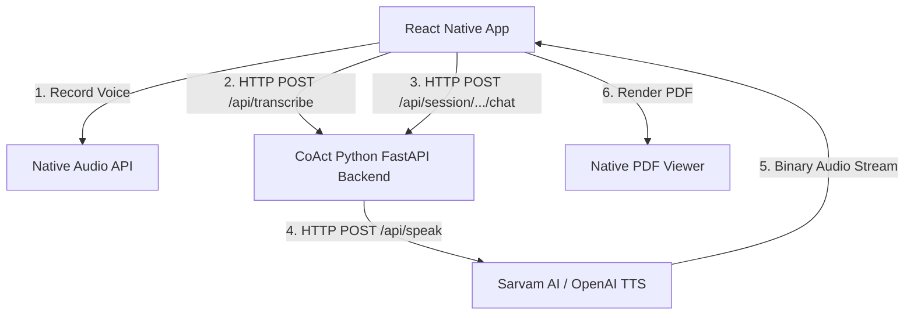

# CoAct.AI React Native Mobile Integration Blueprint

This document provides a comprehensive technical blueprint and implementation documentation for porting the **CoAct.AI** web experience into a native mobile application using **React Native (CLI)** or **Expo**.

---

## 1. High-Level Mobile Architecture

The mobile application acts as a thin client that handles native audio hardware (recording and playback), renders clean UI components (simulation and scorecard), and manages state transitions.



---

## 2. Mobile UI/UX Design System

To ensure a highly premium, state-of-the-art visual aesthetic that matches the web application, the React Native app must follow these design tokens, structural layouts, and micro-animations.

### A. Dark Slate Color Palette
A cohesive HSL/Hex color scale optimized for mobile OLED screens:
* **Background:** Deep Navy Slate (`#0f172a` - Slate 900)
* **Surface Cards:** Translucent Slate (`rgba(30, 41, 59, 0.7)` - Slate 800 with opacity)
* **Primary/Accent:** Electric Blue (`#3b82f6` - Blue 500)
* **Success/Pass Meter:** Emerald Green (`#10b981` - Emerald 500)
* **Text Primary:** Pure White (`#ffffff`)
* **Text Secondary:** Soft Slate Muted (`#94a3b8` - Slate 400)

### B. Typography Hierarchy
Use the system's native modern sans-serif typeface (Inter on Android, San Francisco on iOS):
* **H1 (Screen Title):** `fontSize: 26, fontWeight: '700', color: '#ffffff'`
* **H2 (Card Headers):** `fontSize: 18, fontWeight: '600', color: '#3b82f6'`
* **Body Text:** `fontSize: 14, fontWeight: '400', color: '#e2e8f0', lineHeight: 20`
* **Muted Caption:** `fontSize: 12, fontWeight: '400', color: '#94a3b8'`

---

### C. Glassmorphism UI Component (React Native StyleSheet)
Create premium, blur-background floating chat bubbles and session cards:

```javascript
import React from 'react';
import { View, StyleSheet, Text } from 'react-native';

export const GlassmorphicCard = ({ title, children }) => {
  return (
    <View style={styles.card}>
      <Text style={styles.header}>{title}</Text>
      {children}
    </View>
  );
};

const styles = StyleSheet.create({
  card: {
    backgroundColor: 'rgba(30, 41, 59, 0.55)', // Semi-transparent Slate 800
    borderRadius: 16,
    padding: 16,
    borderWidth: 1,
    borderColor: 'rgba(255, 255, 255, 0.08)', // Sleek ultra-thin border
    shadowColor: '#000',
    shadowOffset: { width: 0, height: 10 },
    shadowOpacity: 0.25,
    shadowRadius: 15,
    elevation: 5,
    backdropFilter: 'blur(20px)', // Enabled via specific native packages if supported
  },
  header: {
    fontSize: 16,
    fontWeight: '600',
    color: '#3b82f6',
    marginBottom: 8,
  }
});
```

---

### D. Pulsing Voice Recording Animation (Micro-Animations)
To make the recording button feel alive, implement a continuous radial pulse using `react-native-reanimated`.

```javascript
import React, { useEffect } from 'react';
import { StyleSheet, TouchableOpacity } from 'react-native';
import Animated, { 
  useSharedValue, 
  useAnimatedStyle, 
  withRepeat, 
  withTiming, 
  withSequence 
} from 'react-native-reanimated';

export const PulsingRecordButton = ({ onPress, isRecording }) => {
  const scale = useSharedValue(1);

  useEffect(() => {
    if (isRecording) {
      scale.value = withRepeat(
        withSequence(
          withTiming(1.2, { duration: 600 }),
          withTiming(1.0, { duration: 600 })
        ),
        -1 // Infinite repetition
      );
    } else {
      scale.value = withTiming(1);
    }
  }, [isRecording]);

  const animatedStyle = useAnimatedStyle(() => ({
    transform: [{ scale: scale.value }],
  }));

  return (
    <TouchableOpacity onPress={onPress}>
      <Animated.View style={[styles.outerRing, animatedStyle]}>
        <Animated.View style={styles.innerButton} />
      </Animated.View>
    </TouchableOpacity>
  );
};

const styles = StyleSheet.create({
  outerRing: {
    width: 80,
    height: 80,
    borderRadius: 40,
    backgroundColor: 'rgba(239, 68, 68, 0.2)', // Translucent Red 500
    justifyContent: 'center',
    alignItems: 'center',
  },
  innerButton: {
    width: 60,
    height: 60,
    borderRadius: 30,
    backgroundColor: '#ef4444', // Solid Red 500
  },
});
```

---

## 2. Core Dependencies & Libraries

To match the functional parity of the web app, you must install the following highly-optimized native libraries:

| Capability | Recommended Library | Purpose |
| :--- | :--- | :--- |
| **Audio Recording & Playback** | `react-native-audio-recorder-player` | Captures microphone input and plays back TTS audio streams. |
| **Networking** | `axios` | Handles multi-part audio uploads and JSON endpoints. |
| **Navigation** | `@react-navigation/native` & `@react-navigation/stack` | Manages app screens (Login, Dashboard, Simulation, Report). |
| **State Management** | `zustand` | Ultra-lightweight global state (stores transcript and session details). |
| **PDF Viewer** | `react-native-pdf` & `react-native-blob-util` | Downloads and renders the professional PDF reports generated by the backend. |
| **Offline Vector Graphics**| `react-native-svg` | Renders UI icons, badges, and progress bars. |

---

## 3. Implementation Steps & Code Blueprints

### A. Session State Management (Zustand)
Create a global store (`src/stores/useSessionStore.js`) to manage session flow, transcription history, and UI states.

```javascript
import { create } from 'zustand';

export const useSessionStore = create((set) => ({
  sessionId: null,
  transcript: [],
  isRecording: false,
  isPlayingTTS: false,
  setSession: (id) => set({ sessionId: id, transcript: [] }),
  addMessage: (role, content) => set((state) => ({
    transcript: [...state.transcript, { role, content }]
  })),
  clearSession: () => set({ sessionId: null, transcript: [] }),
}));
```

---

### B. Capturing & Transcribing User Audio
Unlike web browsers, mobile operating systems require explicit native permissions.

#### 1. Add Platform Permissions
* **iOS (`ios/Info.plist`):**
  ```xml
  <key>NSMicrophoneUsageDescription</key>
  <string>CoAct.AI requires microphone access to record your roleplay responses.</string>
  ```
* **Android (`android/app/src/main/AndroidManifest.xml`):**
  ```xml
  <uses-permission android:name="android.permission.RECORD_AUDIO" />
  <uses-permission android:name="android.permission.WRITE_EXTERNAL_STORAGE" />
  ```

#### 2. Recording Implementation Component
Create a hook or utility (`src/hooks/useAudioRecorder.js`) to record voice into a high-quality format (`.wav` or `.mp4`) and upload it to `/api/transcribe`.

```javascript
import AudioRecorderPlayer from 'react-native-audio-recorder-player';
import RNFS from 'react-native-fs';
import axios from 'axios';

const audioRecorderPlayer = new AudioRecorderPlayer();

export const startRecording = async () => {
  const path = `${RNFS.DocumentDirectoryPath}/user_voice.mp4`;
  const result = await audioRecorderPlayer.startRecorder(path);
  console.log('Recording started at:', result);
};

export const stopAndTranscribe = async (sessionId, BACKEND_URL) => {
  const result = await audioRecorderPlayer.stopRecorder();
  console.log('Recording stopped. File saved at:', result);

  // Prepare Multipart Form Data
  const formData = new FormData();
  formData.append('file', {
    uri: Platform.OS === 'android' ? `file://${result}` : result,
    type: 'audio/mp4',
    name: 'audio.mp4',
  });

  try {
    const response = await axios.post(`${BACKEND_URL}/api/transcribe`, formData, {
      headers: { 'Content-Type': 'multipart/form-data' },
    });
    return response.data.text; // Returns transcribed string
  } catch (error) {
    console.error('Transcription upload failed:', error);
    return '';
  }
};
```

---

### C. Streaming & Playing AI Text-To-Speech (TTS)
When the AI responds, request a speech stream and play it using the local player.

```javascript
import AudioRecorderPlayer from 'react-native-audio-recorder-player';
import RNFetchBlob from 'react-native-blob-util';

const player = new AudioRecorderPlayer();

export const playAISpeech = async (text, voice = 'fable', BACKEND_URL) => {
  const cachePath = `${RNFetchBlob.fs.dirs.CacheDir}/ai_speech.wav`;

  try {
    // 1. Download TTS Stream from backend
    await RNFetchBlob.config({ path: cachePath })
      .fetch('POST', `${BACKEND_URL}/api/speak`, {
        'Content-Type': 'application/json',
      }, JSON.stringify({ text, voice }));

    // 2. Play the downloaded audio natively
    await player.startPlayer(cachePath);
    player.addPlayBackListener((e) => {
      if (e.currentPosition === e.duration) {
        player.stopPlayer();
      }
    });
  } catch (error) {
    console.error('TTS playback failed:', error);
  }
};
```

---

### D. Renders Scorecard PDF (Mobile PDF Viewer)
Once the session is completed and the Python backend compiles the PDF, display it in a fully native reader using `react-native-pdf`.

```javascript
import React from 'react';
import { StyleSheet, Dimensions, View } from 'react-native';
import Pdf from 'react-native-pdf';

export default function ReportScreen({ route }) {
  const { pdfPath, BACKEND_URL } = route.params; 
  // pdfPath: e.g. "reports/sess-123_report.pdf"
  const source = { uri: `${BACKEND_URL}/api/reports/${pdfPath}`, cache: true };

  return (
    <View style={styles.container}>
      <Pdf
        source={source}
        onLoadComplete={(numberOfPages) => {
          console.log(`Number of pages: ${numberOfPages}`);
        }}
        onError={(error) => {
          console.error('PDF error:', error);
        }}
        style={styles.pdf}
      />
    </View>
  );
}

const styles = StyleSheet.create({
  container: {
    flex: 1,
    justifyContent: 'flex-start',
    alignItems: 'center',
    backgroundColor: '#0f172a',
  },
  pdf: {
    flex: 1,
    width: Dimensions.get('window').width,
    height: Dimensions.get('window').height,
  }
});
```

---

## 4. Performance Optimizations for Mobile Offline Support

If you want your mobile application to run **entirely offline** without communicating with a centralized backend, follow this localized stack plan:

1. **Local LLM Engine:**
   * Integrate **`llama.rn`** (React Native wrapper for `llama.cpp`) or **`MLC LLM`**.
   * Bundle **`llama3.2:1b`** (quantized Q4 version, ~700MB) directly inside your application package or prompt the user to download it on the first launch.
2. **Local STT (Offline Transcription):**
   * Use **`whisper.rn`** (React Native wrapper for `whisper.cpp`).
   * Download the `whisper-tiny.bin` model (75MB) to run speech-to-text directly on the mobile CPU/Neural Engine.
3. **Local TTS (Offline Voice):**
   * Integrate React Native's native Text-to-Speech library (`react-native-tts`) to leverage the mobile OS native voices (Siri/Google voices), bypassing the need to rely on external APIs like Sarvam or OpenAI.

---

## 5. Development Connection Setup (Bridge to Local Python Backend)
When testing the React Native application on a physical mobile device, the phone must be able to reach your Python FastAPI backend running on `localhost:8000` (or the port your backend uses).

* **If using Android Emulator:** Use IP `http://10.0.2.2:8000` to represent the host machine.
* **If using Physical Android Device:** Connect your phone via USB, enable Developer Mode, and run:
  ```bash
  adb reverse tcp:8000 tcp:8000
  ```
  Now, your mobile app can make requests directly to `http://localhost:8000`.
* **If using iOS Device:** Ensure your laptop and iPhone are connected to the exact same Wi-Fi network, and use your laptop's local IP address (e.g. `http://192.168.1.XX:8000`).
