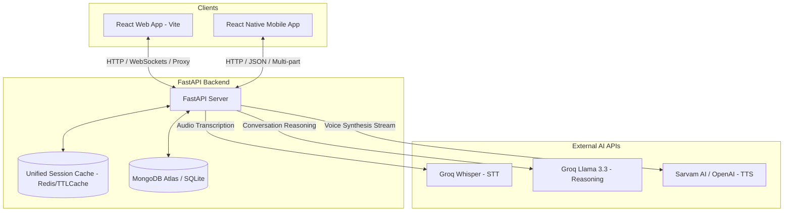

# CoAct.AI — Running Guide & Architecture

<p align="center">
  
</p>

Welcome to the **CoAct.AI** codebase. CoAct.AI is an AI-powered interactive roleplay simulation platform consisting of a React-based web app, a React Native mobile app, and a FastAPI backend.

---

## 1. System Architecture

CoAct.AI is built as a split-architecture application with a centralized Python FastAPI backend serving two client applications: a React-based web app and a React Native-based mobile app. 

### High-Level Architecture Diagram



### Component Details
1. **Frontend Web App (`inter-ai-frontend`)**:
   - Built with **React**, **Vite**, **TypeScript**, and **TailwindCSS**.
   - Handles client-side audio recording using the browser's MediaRecorder API.
   - Communicates with the backend using relative URLs proxied through Vite's dev server locally, or Nginx in production.
2. **Mobile App (`CoActMobile`)**:
   - Built with **React Native (CLI)**.
   - Leverages native device APIs for audio recording (`react-native-audio-recorder-player`) and PDF rendering (`react-native-pdf`).
   - Connects directly to the backend IP/Port.
3. **Backend API Server (`inter-ai-backend`)**:
   - Built with **Python (FastAPI)**.
   - **Authentication**: JWT-based session security via custom tokens.
   - **Rate Limiting**: Custom Token Bucket Rate Limiter to prevent API abuse.
   - **Caching**: Unified Cache supporting local in-memory TTLCache and Redis for session state management.
   - **Database**: SQLite (SQLAlchemy) for rapid local development; MongoDB Atlas for production data persistence.
4. **AI Processing Layer**:
   - **Speech-to-Text (STT)**: Groq Whisper API (`whisper-large-v3-turbo`) for fast transcription.
   - **Reasoning**: Groq Llama 3.3 (`llama-3.3-70b-versatile`) with enterprise security guardrails.
   - **Text-to-Speech (TTS)**: Sarvam AI (`bulbul:v3` for Indian accents) or OpenAI (`tts-1`) for streaming voice audio.
   - **Report Generation**: Consolidates transcripts and scores metrics before generating a downloadable PDF report.

---

## 2. Environment Configuration

The application requires various environment variables for database connections, security, and external AI services.

### API Keys & Services Checklist
- **Groq API Key**: Needed for LLM reasoning and transcription. Get it from [Groq Console](https://console.groq.com/).
- **Sarvam AI Key**: Needed for natural text-to-speech. Get it from [Sarvam Dashboard](https://sarvam.ai/dashboard).
- **OpenAI API Key (Optional)**: Used as fallback TTS. Get it from [OpenAI Platform](https://platform.openai.com/).
- **MongoDB Connection String**: Needed for session persistence. Create a free M0 cluster on [MongoDB Atlas](https://www.mongodb.com/cloud/atlas).

### Environment Files Setup
From the project root, duplicate the templates:
```bash
# Copy root environment file
copy .env.example .env

# Copy backend environment file
copy inter-ai-backend\.env.example inter-ai-backend\.env
```

Edit the newly created `.env` files. Ensure the following variables are correctly configured:
```env
GROQ_API_KEY=your_groq_api_key_here
SARVAM_API_KEY=your_sarvam_api_key_here
MONGODB_URI=mongodb+srv://<username>:<password>@cluster.mongodb.net/coact?retryWrites=true&w=majority
JWT_SECRET=use-a-strong-random-key-in-production
```

---

## 3. How to Run Locally (Development)

Ensure you have **Node.js 18+** and **Python 3.10+** installed on your development machine.

### Method A: Automated Start Script (Windows)
A convenience batch file is provided in the project root to run both backend and frontend development servers concurrently:
```bash
start-dev.bat
```
*This starts the Python backend, waits for it to initialize, boots up the React frontend, and opens it automatically in your browser at `http://localhost:3000`.*

---

### Method B: Manual Startup

#### 1. Start the Backend
1. Navigate to the backend folder:
   ```bash
   cd inter-ai-backend
   ```
2. Create and activate a Python virtual environment:
   ```bash
   python -m venv venv
   # On Windows:
   venv\Scripts\activate
   # On macOS/Linux:
   source venv/bin/activate
   ```
3. Install dependencies:
   ```bash
   pip install -r requirements.txt
   ```
4. Start the FastAPI server:
   ```bash
   python app.py
   ```
   *The backend will boot on `http://localhost:8000`. API docs can be viewed at `http://localhost:8000/docs`.*

#### 2. Start the Web Frontend
1. Navigate to the frontend folder:
   ```bash
   cd inter-ai-frontend
   ```
2. Install packages:
   ```bash
   npm install
   ```
3. Run in development mode:
   ```bash
   npm run dev
   ```
   *Vite will start the dev server at `http://localhost:3000` and proxy all `/api` traffic to port 8000.*

#### 3. Start the Mobile Client
1. Navigate to the mobile folder:
   ```bash
   cd CoActMobile
   ```
2. Install JS dependencies:
   ```bash
   npm install
   ```
3. For iOS (macOS only), install CocoaPods:
   ```bash
   cd ios && pod install && cd ..
   ```
4. Run on Emulator/Device:
   - **Android Emulator**:
     ```bash
     npm run android
     ```
   - **iOS Simulator**:
     ```bash
     npm run ios
     ```

> [!NOTE]
> **Mobile Emulator/Device Network Bridge**:
> The mobile client in `CoActMobile/src/lib/api.ts` is configured to target port `8000`.
> - **iOS Simulator** communicates via `http://localhost:8000`.
> - **Android Emulator** automatically maps to the host machine via `http://10.0.2.2:8000`.
> - **Physical Devices** must use your laptop's LAN IP (e.g., `http://192.168.1.50:8000`). Make sure your device is on the same Wi-Fi network as the backend host.

---

## 4. Product Interface Preview

Here is a preview of the CoAct.AI dashboard interface and brand theme mockup:

<p align="center">
  
</p>

<p align="center">
  
</p>

---

## 5. Documentation Index

Additional detailed guides are located in the **[Docs](file:///d:/GH%20INDUCTION/COACT%20PROJECT/Docs)** folder:

- **[Detailed Environment Setup Guide](file:///d:/GH%20INDUCTION/COACT%20PROJECT/Docs/ENV_SETUP.md)** — In-depth guide to obtaining Groq, Sarvam, OpenAI, and MongoDB keys and configuring `.env` files.
- **[Production Server Deployment Guide](file:///d:/GH%20INDUCTION/COACT%20PROJECT/Docs/DEPLOYMENT.md)** — Step-by-step production deployment using Docker & Nginx.
- **[Mobile Integration Blueprint](file:///d:/GH%20INDUCTION/COACT%20PROJECT/Docs/MOBILE_REACT_NATIVE_BLUEPRINT.md)** — Detailed specification for the React Native implementation.
- **[SSL Certificate Configuration](file:///d:/GH%20INDUCTION/COACT%20PROJECT/Docs/SSL_SETUP.md)** — How to set up HTTPS and Let's Encrypt certificates.
- **[Security Policy](file:///d:/GH%20INDUCTION/COACT%20PROJECT/Docs/SECURITY.md)** — Security disclosures and compliance guidelines.
- **Component Specific READMEs**:
  - **[Root README](file:///d:/GH%20INDUCTION/COACT%20PROJECT/Docs/root_README.md)**
  - **[Backend README](file:///d:/GH%20INDUCTION/COACT%20PROJECT/Docs/backend_README.md)**
  - **[Frontend README](file:///d:/GH%20INDUCTION/COACT%20PROJECT/Docs/frontend_README.md)**
  - **[Mobile README](file:///d:/GH%20INDUCTION/COACT%20PROJECT/Docs/mobile_README.md)**
